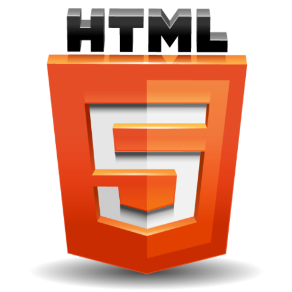
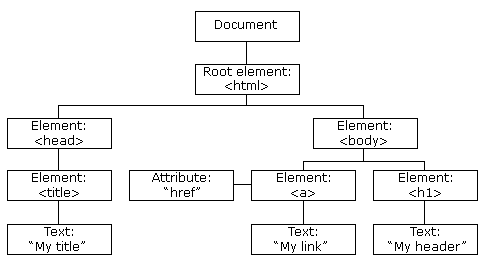

# HyperText Markup Language (HTML)

HTML es un lenguaje de etiquetas usado por los diseñadores y programadores para crear páginas web.

Este lenguaje es un estándar reconocido por todo el mundo. Sus normas las define un organismo sin ánimo de lucro llamado [World Wide Web Consortium](https://www.w3.org/)

Se ha convertido en el estándar de visualización de la información, siendo la vista de muchas aplicaciones, tanto de las páginas web más tradicionales como de aplicaciones de servidor para servicios empresariales.

Una **etiqueta** (o **tag** en inglés) es la marca que usa el lenguaje para delimitar a un elemento específico.

Las etiquetas o marcas están definidas por caracteres de escape que indican al software que lee el documento cuándo comienza y acaba el tag o etiqueta. En lenguajes de marcado como HTML existen etiquetas o marcas que usan el carácter “<” para abrir, o el “</” para cerrar la etiqueta. Ejemplo:

    <etiqueta>contenido</etiqueta>

Empecemos por mostrar un poco de código de una página HTML en su formato más básico:

    <!DOCTYPE html>
    <html>
        <head>
            <title>Mi primer documento HTML</title>
        </head>

        <body>
            
Hola Mundo

        </body>
    </html>

Las partes más importantes de un fichero HTML son las siguientes:

1. **Etiqueta DOCTYPE**, informa al navegador del tipo de documento y cuál es la versión. En este caso estamos definiendo un documento HTML version 5 (HTML5). Para hacer documentos de versiones anteriores a la 5, la etiqueta era bastante más complicada de escribir.
2. **Etiqueta HTML**, es donde esta limitado todo nuestro codigo HTML
3. **Etiqueta HEAD**, elemento que contiene los encabezados de la página. Esta etiqueta suele incluir:
    - Etiquetas meta, que llevan información interna de la página web. También llamadas "metatags" y sirven para integrar metadatos sobre la página. Normalmente se utilizan para dar información a los motores de búsquedas (por ejemplo Google) y mejorar la indexación de la página. Esto es importante a la hora del posicionamiento web. 
    - Etiqueta title, que lleva el nombre que aparecerá en la pestaña o en la barra del navegador.
    - Recursos enlazados, para enlazar fuentes de recursos con la página, como puede ser CSS o JavaScript
4. **Etiqueta BODY**, define el cuerpo del documento HTML, en esta se incluyen todas las etiquetas que veremos a continuación en el curso, y por supuesto los atributos y el texto o contenido de cada elemento. Es posiblemente la etiqueta más importante, ya que será lo que el usuario final verá en la página.

Todas las etiquetas anteriores serían obligatorias para tener un documento HTML bien formado. Si no las ponemos, entonces se ejecutará correctamente dependiendo del navegador (los navegadores modernos normalmente lo ejecutará bien).

## HTML5

Esta versión surge debido a la necesidad de adapatar el lenguaje HTML a la creación de aplicaciones modernas.

Por ejemplo, el declive de uso de Adobe Flash para dotar de dinamismo nuestras páginas, ha llevado a que HTML5 disponga de herramientas para que nuestros navegadores puedan gestionar audio, vídeo, animaciones vectoriales, componentes de interfaz, entre muchas otras cosas. Ahora HTML5 es capaz de hacer esto sin necesidad de plugins y con una gran compatibilidad entre navegadores.

Otro ejemplo sería a nivel de desarrollo de formularios. Los desarrolladores necesitaban algún estandar que permitiera validar los datos sin la necesidad de hacerlo manualmente con JavaScript.

Dentro del desarrollo web podemos encontrar 3 grandes tecnologías: **HTML5, CSS3 y JavaScript**. Cada una de estas tecnologías tendrá su función en una página web:

1. La estructura de la pagina la lleva HTML (Etiquetas HTML)
2. Los estilos de la pagina lo lleva CSS (los colores, los tamaños de las letras, la colocacion de las etiquetas, etc.)
3. La funcionalidad de la pagina es programada en JavaScript (lo que puede hacer la pagina web cuando pulsamos un boton, etc.)

## Como comenzar

Podemos empezar a ver los ejemplos que estan numerados dentro de esta carpeta (01_HTML)

**Nota**: Para crear un fichero HTML con VSC debemos crear un nuevo fichero con extensión .html. Para rellenar un contenido básico debemos de poner dentro del fichero "html:5" y pulsar enter. Esto último solo funcionaría si tenemos instalada la extensión "beautify"

## Modelo de objetos DOM

El **Document Object Model** (DOM) es el árbol creado por las aplicaciones para representar la estructura de los documentos de tipo HTML y XML.

Cuando creamos un documento XML o HTML, es muy importante entender que cada etiqueta se convertirá en el navegador en un nodo o un objeto del DOM, permitiendo a otros lenguajes acceder a ellos y pudiendo acceder a sus métodos o atributos. El lenguaje más extendido para trabajar con el DOM es JavaScript.

La interfaz del Modelo de Objetos del Documento (DOM) tiene una gran similitud con la de un arbol, cada nodo tendrá un nodo padre pero podrá varios nodos hijos.

Dentro del DOM podemos encontrar diferentes tipos de nodos. Los principales tipos de nodos que podemos encontrar son:

1. **Document:** El objeto document es el nodo raíz, a partir del cual derivan el resto de nodos. Es la frontera entre el navegador y nuestro contenido.
2. **Element:** Son los nodos creados por las propias etiquetas de HTML. Un documento web está formado por una jerarquía de nodos. Lo habitual es aplicarles términos de parentesco; si dentro de una etiqueta contenedora **div** ponemos dos etiquetas de párrafo **p**, estas **p** serán las hijas de la etiqueta **div**.
3. **Text:** Es el contenido dentro de un **Nodo Element**.
4. **Attr (Atributo):** Representa un atributo de un **Nodo Element**.
5. **Comment:** Representa un comentario escrito por el diseñador.

Una vez tenemos el DOM creado, podremos ser capaces de recorrerlo y alterarlo a nuestro antojo mediante lenguajes como **JavaScript**, dando así un comportamiento dinámico a nuestras páginas web.

## Bibliografía

- <https://www.w3schools.com/html/default.asp>
- <https://developer.mozilla.org/es/docs/conflicting/Web/HTML/Element>
- [Arbol Dom](http://www.gnu.org/software/classpathx/jaxp/apidoc/org/w3c/dom/tree.html)

### Textos falsos

- [Enlace Lorem Ipsum para copiar textos ficticios](http://es.lipsum.com/)
- [Enlace Chiquito Ipsum](https://www.chiquitoipsum.com/)

### Fotos
- <https://morguefile.com/>
- <https://es.freeimages.com/>
- <https://www.pexels.com/>
- <https://unsplash.com/>
- <http://realisticshots.com/>

### Iconos
- <https://www.iconfinder.com/>
- <https://findicons.com/>
- <https://fontawesome.com/>

### Herramientas

- [Visualizar HTML desde Github](https://htmlpreview.github.io/)
- [Can I Use (Compatibilidad de HTML5 con navegadores)](https://caniuse.com/)

### Varios

- [Ejercicios HTML y CSS](http://desarrolloweb.dlsi.ua.es/libros/html-css/ejercicios)

