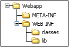

# Java JEE

# La arquitectura cliente-servidor

A diferencia de la arquitectura local, donde todo se centralizaba en el mismo equipo, la arquitectura cliente-servidor cuenta con dos elementos o capas.

1. Servidor. En lugar de tener instalada la aplicación en cada equipo donde se va a utilizar, esta se ejecuta en un ordenador remoto, al que conocemos como servidor. 

2. Cliente. Su objetivo es comunicarse con el usuario final y realizar peticiones al servidor.

Entre las ventajas de este modelo frente a la arquitectura local podemos destacar:

1. La aplicación se instala en un único equipo, lo que facilita su mantenimiento (mejoras, evolutivos, etc).
2. Puesto el cliente que no tienen que ejecutar ningún código de la aplicación, los clientes no necesitan disponer de ningún tipo de hardware o software especial, solo la capacidad de comunicarse con el servidor para enviarle datos y de presentar los resultados que la aplicación le devuelva.

Este tipo de arquitectura **NO** está ligada a ningún lenguaje en concreto, pero para estos ejemplos de aquí nos basaremos en JEE para su implementación.

## Introducción al protocolo HTTP

Es cierto que en un modelo cliente servidor no es necesario usar un protocolo específico, pero normalmente usaremos el protocolo **HTTP** para las peticiones.

HTTP, de sus siglas en inglés: "Hypertext Transfer Protocol", es el nombre de un protocolo el cual nos permite realizar una petición de datos y recursos, como pueden ser documentos HTML. Es la base de cualquier intercambio de datos en la Web, y un protocolo de estructura cliente-servidor, esto quiere decir que una petición de datos es iniciada por el elemento que recibirá los datos (el cliente), normalmente un navegador Web. 

Cada vez que introducimos la dirección de un recurso desde un navegador, pulsamos un enlace o el botón de una página, estamos lanzando una petición HTTP hacia un servidor.

La dirección del recurso, conocida también como URL, tiene el siguiente formato:

	http://SERVIDOR:PUERTO/APLICACION/RECURSO
		
1. Servidor. Se trata de la dirección IP o nombre de dominio del equipo físico donde se encuentra la aplicación.

2. Puerto. Dentro del servidor, las llamadas HTTP son atendidas por un programa, conocido como servidor web, que se encuentra escuchando por uno de los puertos lógicos del equipo.

3. Aplicación. Se trata de la dirección asignada a la aplicación cuando se instaló. Es posible que en algunos entornos esto se pueda obviar.

4. Recurso. Una aplicación está formada por diferentes componentes o recursos. Cada uno de ellos tiene asociada una dirección, que se indicará en la última parte de la URL, cada vez que se quiera acceder a dicho recurso.

Una vez procesada la petición, el servidor de la capa intermedia envía una respuesta HTTP al cliente. En la cabecera de la respuesta se incluye la información de control para el navegador, como el código HTTP con el resultado de la ejecución de la llamada, las cookies que el navegador debe almacenar, etc.; mientras que en el cuerpo de la respuesta se mandan los datos que constituyen el resultado de la petición enviada, formateados en un lenguaje que el navegador pueda interpretar de cara a presentar dichos datos adecuadamente en pantalla. 

Además de una URL del recurso, una petición HTTP tiene asociado un método, verbo o acción que quiere realizar con el recurso.

(Ver imagenes en img/http/)

## Tecnologías Java EE

La plataforma Java EE está formada por una serie de tecnologías y especificaciones:

1. Componentes. Los componentes son los bloques funcionales que constituyen la aplicación. Una aplicación web Java EE está formada por una serie de componentes que se interrelacionan entre sí para conseguir llevar a cabo los objetivos de la misma. La especificación Java EE proporciona varios tipos de componentes para implementar los bloques de la aplicación, estos son los **Servlets, JSPs, EJBs**.  

2. Servicios. Los servicios representan una serie de utilidades estándar, proporcionadas por el contenedor y que están a disposición de todas las aplicaciones. La Java EE incorpora una serie de APIs para que los componentes puedan acceder a estos servicios, como el acceso a bases de datos, el control de seguridad, etc. Aquí podemos encontrar los servicios basados en tecnología **SOAP** y los servicios basados en tecnología **REST**

## Contenedores Java EE

Los componentes Java EE se ejecutan sobre los llamados **contenedores**. Un contenedor es un bloque software que forma parte del servidor de y proporciona todos los servicios necesarios para que el componente pueda ejecutarse.

Los servidores Java EE cuentan con dos contenedores:

1. Contenedor Web. Es el contenedor sobre el que se ejecutan los servlets y las páginas JSP.

2. Contenedor EJB. Sobre él se ejecutan los componentes EJB. No todos los servidores cuentan con este tipo de contenedor, como puede ser el caso de Apache Tomcat, que solo dispone de contenedor web y, por tanto, no podrá ejecutar aplicaciones que incluyan EJBs (De hecho, solo cuenta con el módulo para ejecutar servlets y JSP).

## Estructura de una aplicación web Java EE

Según la especificación Java EE, los diferentes componentes que forman parte de una aplicación deben ser organizados en una serie de directorios como se muestran en la siguiente imagen:

1. WebApp. Contiene los elementos estáticos de la aplicación (archivos, imágenes, etc.), así como las páginas JSP que se guardarán en
archivos de texto con extensión .jsp. Todos estos archivos pueden organizarse en subdirectorios dentro de este directorio raíz.

2. WEB-INF. En la carpeta WEB-INF encontramos directamente el archivo de descripción de despliegue **web.xml** que contiene la configuración global de nuestra aplicación. La existencia de este archivo es opcional desde la versión 3.0 y se utiliza para suministrar al contenedor web diferentes parámetros sobre la aplicación, como las páginas de bienvenida, los servlets, la configuración de sesiones o las referencias a recursos, entre otros. Es importante notar que TODO lo que pongamos en esta carpeta será inaccesible desde el exterior del servidor.

3. Classes. Todas las clases de la aplicación (servlets, EJBs, clases estándares Java o JavaBeans) se situarán dentro de este directorio, organizadas en sus diferentes paquetes y subpaquetes. Solamente se pondrán aquí las clases compiladas, es decir, los ficheros. .class.

4. Lib. En algunos casos, las aplicaciones deben utilizar alguna librería externa de clases no incluida en el Java estándar ni en el Java Enterprise. Estas librerías deberán situarse en esta carpeta para ser distribuidas, junto con la aplicación, cuando esta última vaya a ser desplegada en el servidor.

## Servlets

Los **Servlets** se tratan de objetos especiales Java cuya misión es atender las peticiones que llegan desde la capa cliente, y generar las respuesta a los mismos. Los **Servlets** proporcionan un modelo de comunicación entre la petición de un usuario web y un servidor web.

Es importante entender, que nosotros como programadores nunca crearemos objetos de tipo servlet, será el propio contenedor web el que nos cree los servlets por nosostros y de mantener su ciclo de vida. Este concepto es conocido en POO como **IoC** o inversión de control. Nosotros como programadores nos limitaremos a programar el comportamiento de los servlets.

Además, todo servlet tiene asociada una dirección conocida como **servlet_path**, que será la manera en la que le podamos invocar. 

## Principales tareas de un servlet:

1. Leer los datos enviados por un cliente, típicamente un navegador web.

2. Generar resultados procesando datos.

3. Enviar datos al cliente, típicamente un navegador web.

## Servlet Packages

javax.servlet and javax.servlet.http packages contienen las clases y las interfaces para usar los Servlets. Estas clases y paquetes forman parte de la versión JEE (Java Enterprise Edition). Estas clases usan principalmente el protocolo HTTP.

## Ciclo de vida de un Servlet:

1. Creación de una instancia de Servlet. El contenedor web crear una instancia del servidor. Solamente **se creará una instancia de la clase para todo el contenedor**, es decir, todas las peticiones al servidor serán ejecutadas sobre la misma instancia.

2. Llamada al método init(). Se ejecuta el método init(). Solo se ejecuta una vez y suele ser usado para inicializar el servlet.

3. Llamada al método service(). Después de inicializar el servlet, el contenedor web llamará al método service(). Este método se llamará cada vez que se haga una petición web.

4. Llamada al método destroy(). Este método es llamado antes de que el contenedor web elimine la instancia del servlet.

## Interfaz Servlet

La interfaz Servlet contiene los método comunes a todos los servlets. Nos dice cual tiene que ser el comportamiento de todos los servlet. Al ser una interfaz especifica el QUE tiene que hacer, no el cómo.

Podemos crear un servlet implementando dicha interfaz e implementando sus método

## GenericServlet

La clase GenericServlet implementa la interfaz Servlet. Esta clase es independiente del protocolo (no está ligada a ningún protocolo como el HTTP o el FTP). Sigue sin proporcionar una implementación al método service().

## HttpServlet

Esta clase extiende de la clase GenericServlet y es dependiente del protocolo HTTP. En este caso implementa el método service() llamando al siguiente método

Service(HttpServletRequest req, HttpServletResponse res): Recibe la petición HTTP del método service() y llama al método doXXX, siendo XXX el verbo HTTP de la petición.

## Configurar el descriptor de despliegue con un servlet

Hay un fichero en las aplicaciones web java llamado **web.xml** que es conocido como el descriptor de despliegue. Es un fichero XML cuyo elemento raíz es **web-app**. Es en este fichero donde damos de alta todos los componentes web que vamos a usar (Servlets, Filters, etc) siempre y cuando estemos trabajando con versiones de **web.xml** anteriores a la 3.0. En versiones posteriores podemos usar la anotación **@Websevlet**

Para dar de alta un servlets en el descriptor de despliegue (web.xml):

	<servlet>
      <display-name>HolaMundoServlet</display-name>
      <servlet-name>HolaMundoServlet</servlet-name>
      <servlet-class>servlets.HolaMundoServlet</servlet-class>
      <load-on-startup>1</load-on-startup>  
	</servlet>
  
Para mapear una URL a un servlet en el descriptor de despliegue:

	<servlet-mapping>
      <servlet-name>HolaMundoServlet</servlet-name>
      <url-pattern>/HolaMundoServlet</url-pattern>
	</servlet-mapping>

En versiones más modernas de JEE podemos usar anotaciones para crear y configurar los componentes web, en vez de usar un XML.

## Configurar una página de bienvenida en el descriptor de despliegue

Podemos programar una página de bienvenida en el fichero **web.xml**.

Primero, el servidor web mira si existe la etiqueta **welcome-file-list** en el web.xml. Si existe, entonces mira la lista de páginas de bienvenida que hay dentro de la etiqueta en el orden establecido.

Si no existiera, entonces el servidor miraría en el siguiente orden los ficheros: index.html, index.htm, index.jsp, default.html, default.htm and default.jsp.

## Bibliografia

- <https://developer.mozilla.org/es/docs/Web/HTTP/Basics_of_HTTP>
- <https://docs.oracle.com/javaee/7/tutorial/servlets.htm>
